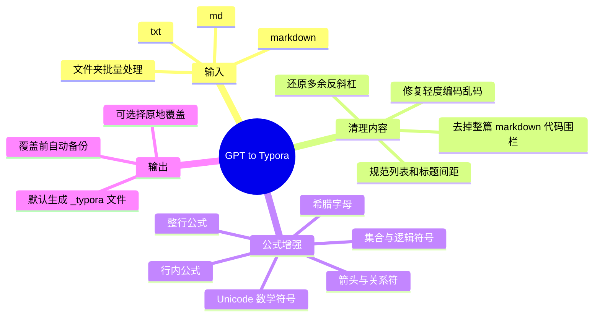

# GPT to Typora Markdown Cleaner

✍️ 一个用于清理 GPT 复制文本的小工具，让 Markdown 在 Typora 里更稳定地渲染标题、列表、代码块和 LaTeX 公式。

## 🧭 思维导图



## 🚀 最简单用法：拖拽文件

把 `.md`、`.markdown` 或 `.txt` 文件拖到这个批处理文件上：

```text
拖拽文件到这里转换.bat
```

脚本会在原文件旁边生成一个新文件，文件名会多出 `_typora`：

```text
原文件.md
原文件_typora.md
```

转换完成后，终端会询问：

```text
Open converted file(s) now? [O] Open  [C] Close:
```

按 `O` 会立即打开转换后的文件；按 `C` 会直接关闭终端。

也可以一次拖多个文件，或者拖一个文件夹。拖文件夹时，脚本会处理文件夹第一层里的 `.md`、`.markdown`、`.txt` 文件。

## 🔧 它能解决什么问题

- 🧱 整篇内容被包在 ` ```markdown ` 代码块里，Typora 把正文当代码显示。
- 🪄 Markdown 符号被多余反斜杠转义，例如 `\#`、`\*`、`\[`。
- 🧮 LaTeX 公式没有使用 Typora 更稳定的 `$...$` 或 `$$...$$` 包裹。
- 📐 行内公式没有渲染，例如 `(\nu)`、`(\beta>\omega_0)`、`(A \land B)`。
- 📏 整行公式没有渲染，例如 `(x=A\cos(\omega t+\varphi))`。
- 🧹 文件编码不统一导致读取异常或轻度乱码。

## 🧪 公式转换示例

转换前：

```markdown
频率 (\nu)：赫兹，Hz

(\beta>\omega_0)：过阻尼

(x=A\cos(\omega t+\varphi))

命题 (A \Rightarrow B) 成立

集合 (x ∈ A)
```

转换后：

```markdown
频率 $\nu$：赫兹，Hz

$\beta>\omega_0$：过阻尼

$$x=A\cos(\omega t+\varphi)$$

命题 $A \Rightarrow B$ 成立

集合 $x ∈ A$
```

## 🧠 常用 LaTeX 支持范围

脚本会识别常见 LaTeX 命令，并判断圆括号里的内容是否更像数学表达式。

| 类型 | 示例 |
| --- | --- |
| 希腊字母 | `\alpha`、`\beta`、`\gamma`、`\Delta`、`\Omega` |
| 函数与运算 | `\frac`、`\sqrt`、`\sum`、`\int`、`\lim`、`\sin`、`\log` |
| 关系符 | `\leq`、`\geq`、`\neq`、`\approx`、`\equiv` |
| 集合符号 | `\in`、`\notin`、`\subseteq`、`\cup`、`\cap`、`\emptyset` |
| 逻辑符号 | `\land`、`\lor`、`\neg`、`\forall`、`\exists`、`\implies` |
| 箭头 | `\to`、`\rightarrow`、`\Leftarrow`、`\Leftrightarrow` |
| 字体与装饰 | `\mathbb`、`\mathbf`、`\mathcal`、`\vec`、`\overline` |
| Unicode 符号 | `∀`、`∃`、`∈`、`∧`、`∨`、`≤`、`≥`、`∑`、`∫` |

### 📚 可识别公式字符速查

下面这些命令出现在圆括号内容中时，脚本通常会把整段识别为公式，并自动改成 Typora 更容易渲染的 `$...$` 或 `$$...$$`。

```text
希腊字母：
\alpha \beta \gamma \delta \epsilon \varepsilon \zeta \eta
\theta \vartheta \iota \kappa \lambda \mu \nu \xi \pi \varpi
\rho \varrho \sigma \varsigma \tau \upsilon \phi \varphi \chi
\psi \omega
\Gamma \Delta \Theta \Lambda \Xi \Pi \Sigma \Upsilon \Phi \Psi \Omega

函数、极限、微积分：
\frac \dfrac \tfrac \binom \sqrt
\sum \prod \coprod \int \iint \iiint \oint
\lim \limsup \liminf \partial \nabla \infty
\sin \cos \tan \cot \sec \csc
\arcsin \arccos \arctan \sinh \cosh \tanh
\ln \log \lg \exp \max \min \sup \inf \det \dim \gcd \Pr

运算与关系：
\cdot \times \div \pm \mp \circ \bullet \ast \star
\leq \geq \neq \approx \sim \simeq \equiv \propto
\parallel \perp \angle \degree \prime
\ldots \cdots \vdots \ddots

集合、逻辑、箭头：
\in \not \notin \ni \subset \supset \subseteq \supseteq
\subsetneq \supsetneq \cup \cap \emptyset \varnothing \setminus
\forall \exists \nexists \land \lor \lnot \neg \wedge \vee
\oplus \otimes \therefore \because \mid
\to \mapsto \gets \leftarrow \rightarrow \leftrightarrow
\Leftarrow \Rightarrow \Leftrightarrow
\longleftarrow \longrightarrow \longleftrightarrow
\Longleftarrow \Longrightarrow \Longleftrightarrow
\implies \iff

括号、字体、装饰、文本：
\left \right \big \Big \bigg \Bigg
\langle \rangle \lfloor \rfloor \lceil \rceil
\overline \underline \hat \bar \vec \dot \ddot \tilde
\mathbb \mathbf \mathrm \mathit \mathcal \mathfrak \operatorname
\text \quad \qquad \begin \end
```

也支持常见 Unicode 数学符号触发识别：

```text
∀ ∃ ∄ ∈ ∉ ∋ ⊂ ⊃ ⊆ ⊇ ∪ ∩ ∧ ∨ ¬
⇒ ⇐ ⇔ → ← ↔ ≤ ≥ ≠ ≈ ≡ ∞ ± ∓ × ÷ ·
√ ∑ ∏ ∫ ∂ ∇
```

## 💻 命令行用法

在当前目录打开 PowerShell：

```powershell
python gpt_to_typora.py "1. 振动的基本概念.md"
```

默认不会覆盖原文件，会生成：

```text
1. 振动的基本概念_typora.md
```

如果想直接覆盖原文件：

```powershell
python gpt_to_typora.py "1. 振动的基本概念.md" --in-place
```

使用 `--in-place` 时，脚本会先创建备份：

```text
1. 振动的基本概念.md.bak
```

## 📦 批量处理

一次处理多个文件：

```powershell
python gpt_to_typora.py "第1章.md" "第2章.md" "第3章.md"
```

处理当前文件夹第一层中的所有支持文件：

```powershell
python gpt_to_typora.py "."
```

## 🔁 从管道输入

不传文件时，脚本会从标准输入读取，处理后输出到终端：

```powershell
Get-Content "原文.md" | python gpt_to_typora.py > "清理后.md"
```

## 🗺️ 工作流程


## ⚠️ 注意事项

- 请把 `拖拽文件到这里转换.bat` 和 `gpt_to_typora.py` 放在同一个文件夹里。
- 脚本会尽量保守处理，只转换看起来像数学表达式的圆括号内容。
- 如果 Typora 仍不显示公式，请检查 Typora 设置里是否开启了 Markdown 扩展中的数学公式支持。
- 使用 `--in-place` 会覆盖原文件，但脚本会先自动生成 `.bak` 备份。
